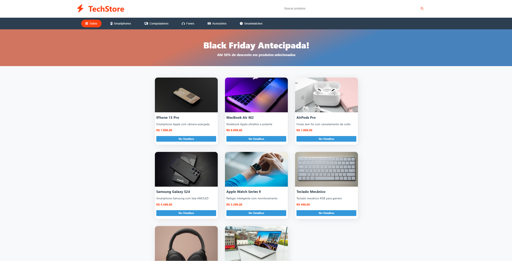
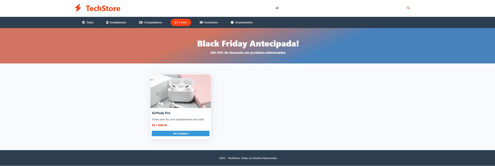

# 🛍️ E-commerce Store

A fully responsive e-commerce web application built using **HTML, CSS, and JavaScript**.

This project simulates an online store where users can browse products, filter them by category, and search for specific items by name — all without using frameworks or external libraries.

---

## 📦 Technologies Used

- HTML5
- CSS3
- JavaScript (Vanilla JS)

---

## 🖼️ Screenshots

### 🏠 Home Page


### 🗂️ Filtered Product


---

## 🎯 Features

- 🛒 Product listing
- 🔎 Search products by name
- 🗂️ Filter products by category
- ⚡ Dynamic rendering with JavaScript
- 🧠 Client-side filtering logic

---

## 🛠️ How It Works

The application uses a structured list of products stored in JavaScript.  
Users can:

- Type in the search bar to filter products by name.
- Click category buttons to display only products from a selected category.
- Combine search and category filters dynamically.

All filtering happens on the client side using JavaScript array methods such as:

- `filter()`
- `map()`
- `includes()`

No backend or database is required.

---

## 📂 Project Structure

```bash
ecommerce-store/
│
├── index.html
├── style.css
└── script.js
```

---

## ▶️ How to Run Locally

1. Clone the repository:

```bash
git clone https://github.com/nicolasandreos/ecomerceTechStore.git
```

2. Open the project folder:

```bash
cd ecommerce-store
```

3. Open the `index.html` file in your browser.

No installation or dependencies required.

---

## 💡 Learning Objectives

This project was built to practice:

- DOM manipulation
- Event handling
- Dynamic rendering
- Filtering logic
- Clean UI structuring with CSS
- Building a complete project without frameworks

---

## 👨‍💻 Author

Developed by Nicolas Andreos.
